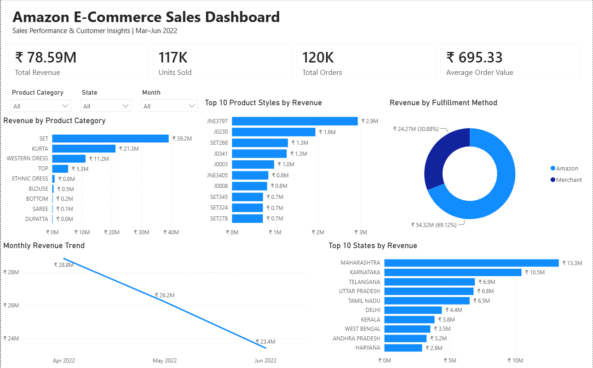

# Amazon E-Commerce Sales Analytics | SQL & Power BI

## Project Overview

This project presents an end-to-end analysis of Amazon e-commerce sales data using MySQL and Power BI. The goal was to transform raw transactional data into a validated analytical dataset, investigate key sales and operational performance questions, and communicate the results through an interactive business intelligence dashboard.

The project covers the complete analytics workflow, including data ingestion, validation, profiling, cleaning, SQL-based business analysis, KPI development, Power BI visualization, and business insight generation.

The final dashboard provides an interactive view of overall sales performance, product performance, geographic revenue distribution, monthly revenue trends, and fulfillment performance.

## Business Objective

The objective of this project was to analyze Amazon e-commerce sales data and answer key business questions such as:

- What is the overall sales performance?
- Which product categories generate the most revenue?
- Which individual product styles are the strongest performers?
- Which geographic markets contribute the most revenue?
- How does revenue change over time?
- How is revenue distributed across fulfillment methods?
- What data-quality issues or limitations should be considered when interpreting the results?

The analysis was designed to convert transactional sales data into actionable business insights that could support decisions related to product strategy, inventory planning, geographic prioritization, fulfillment, and sales performance monitoring.

## Dataset

The project uses the **Amazon Sale Report** dataset, a publicly available e-commerce dataset obtained from Kaggle. It contains transactional sales records covering product, order, fulfillment, shipping, geographic, and revenue-related information.

The source dataset contains approximately 129,000 records and 22 business-relevant columns after excluding non-analytical fields from the original CSV.

Key fields used throughout the analysis include:

- `order_id` – unique order identifier
- `order_date` – transaction date
- `order_status` – status of the order
- `category` – product category
- `style` – product style identifier
- `sku` – stock keeping unit
- `quantity` – number of units associated with the transaction
- `amount` – recorded transaction amount
- `fulfilment_method` – fulfillment method associated with the order
- `ship_service_level` – shipping service level
- `ship_city` – destination city
- `ship_state` – destination state
- `ship_country` – destination country

### Data Coverage

The dataset covers transactions from:

- **March 31, 2022 to June 29, 2022**

Because March contains only one day of transactions, March was excluded from comparative monthly trend analysis to avoid creating a misleading month-over-month comparison.

The underlying March records were retained in the analytical dataset and remain available for other analyses where appropriate.

---

## Tools & Technologies

| Tool / Technology | Purpose |
|---|---|
| **MySQL** | Database creation, data storage, validation, cleaning, and business analysis |
| **MySQL Workbench** | SQL development, database management, query execution, and result validation |
| **SQL** | Data profiling, validation, transformation, KPI calculation, aggregation, and business analysis |
| **Power BI Desktop** | Data modeling, DAX measures, interactive dashboard development, and visualization |
| **Power Query** | Data-source validation, schema review, data-type verification, and Power BI data preparation |
| **DAX** | Creation and validation of dashboard KPIs and analytical measures |
| **Git** | Local version control and project change tracking |
| **GitHub** | Repository hosting, project documentation, and portfolio presentation |
| **Visual Studio Code** | Development and maintenance of SQL scripts and Markdown documentation |

---

## Project Workflow

The project followed a structured analytics workflow from raw data ingestion through business reporting:

**Raw CSV Data → MySQL Staging → Data Validation & Profiling → Data Cleaning → SQL Business Analysis → Power BI → Business Insights & Recommendations**

### 1. Data Ingestion

- Created the `amazon_ecommerce_db` database in MySQL.
- Created a staging table to preserve the imported transactional data.
- Loaded the Amazon sales CSV into MySQL using `LOAD DATA LOCAL INFILE`.
- Excluded non-analytical source fields such as the exported index and empty `Unnamed: 22` column during the database workflow.

### 2. Data Validation & Profiling

Performed SQL-based quality checks before analysis, including:

- Record and column validation
- Missing-value analysis
- Duplicate investigation
- Order ID validation
- Revenue-field validation
- Shipping-location completeness checks
- Categorical-value inspection
- Date-range validation

This stage identified several data-quality issues that required either cleaning or explicit analytical treatment.

### 3. Data Cleaning

Created a dedicated `clean_amazon_sales` analytical table rather than modifying the staging data directly.

Cleaning activities included:

- Trimming unnecessary whitespace from text fields
- Standardizing state values
- Converting blank values to appropriate `NULL` representations where required
- Preserving legitimate missing shipping-location values rather than inventing replacements
- Retaining the raw staging layer separately from the cleaned analytical layer

### 4. SQL Business Analysis

Used the cleaned dataset to calculate KPIs and answer business questions across:

- Overall revenue performance
- Order volume
- Average Order Value
- Product category performance
- Product style performance
- Geographic revenue distribution
- Monthly sales performance
- Fulfillment performance
- Shipping and order-status analysis

SQL results were used both for business analysis and as validation benchmarks for Power BI.

### 5. Power BI Development

Connected Power BI Desktop to the cleaned MySQL dataset and:

- Validated the imported schema and data types
- Created DAX measures for key performance indicators
- Reconciled Power BI KPI results against SQL results
- Built interactive slicers for Product Category, State, and Month
- Applied Top N filtering where appropriate
- Developed and refined the final dashboard around the highest-value business questions

### 6. Business Interpretation

The final analytical results were translated into:

- Key business findings
- Business impact
- Actionable recommendations
- Data limitations and interpretation considerations

Recommendations were kept within what the available data could reasonably support rather than treating descriptive relationships as causal conclusions.

---

## Data Validation & Cleaning

Before performing business analysis, the raw sales data was systematically profiled and validated in MySQL to identify issues that could affect the reliability of the results.

### Key Data Quality Findings

| Data Quality Issue | Finding | Treatment |
|---|---|---|
| Missing `amount` values | 7,795 records contained `NULL` amounts | Preserved as missing values and accounted for during analysis |
| Missing shipping locations | 33 records contained missing city, state, and country information | Retained as `NULL` rather than assigning unsupported location values |
| Text inconsistencies | Whitespace and inconsistent formatting were identified in categorical fields | Applied `TRIM()` and targeted standardization |
| State formatting | State values required consistency for geographic analysis | Standardized state values before reporting |
| City values | Large number of distinct city values made full manual standardization impractical | Applied whitespace cleaning while avoiding unnecessary manual remapping |
| Duplicate records | Potential duplicates were investigated during profiling | Evaluated before analysis rather than automatically deleting records |
| Partial date coverage | Dataset begins March 31 and ends June 29, 2022 | March excluded from comparable monthly trend reporting |
| Cancelled orders with amounts | Some cancelled transactions retained values in the `amount` field | Documented as an analytical limitation requiring careful revenue interpretation |

### Cleaning Strategy

A separate cleaned analytical table, `clean_amazon_sales`, was created from the staging data.

This approach preserved the imported staging data while providing a controlled dataset for downstream SQL analysis and Power BI reporting.

Key cleaning operations included:

- Applying `TRIM()` to text-based columns.
- Standardizing state values for consistent geographic analysis.
- Handling blank and `NULL` values appropriately.
- Preserving legitimate missing values when no reliable replacement existed.
- Avoiding unnecessary transformations that could introduce unsupported assumptions into the data.
- Maintaining consistent fields and data types for downstream reporting.

### Validation Between SQL and Power BI

After connecting the cleaned dataset to Power BI, the data was validated again before dashboard development.

Power Query profiling was used to review:

- Column quality
- Column distribution
- Column profiles
- Data types
- Missing values

The results were consistent with the earlier SQL validation, so no additional major cleaning transformations were required in Power Query.

Key Power BI measures were also reconciled against SQL results to ensure consistency between the analytical and reporting layers.

For example, the final **Average Order Value of ₹695.33** was validated between SQL and Power BI before being used on the dashboard.

---

## SQL Business Analysis

After completing data validation and cleaning, SQL was used to analyze the `clean_amazon_sales` table and answer the project's core business questions.

The analysis focused on sales performance, product performance, geographic distribution, order behavior, and operational dimensions.

### Core KPIs

SQL was used to establish the primary performance metrics used throughout the project:

| KPI | Result |
|---|---:|
| Total Revenue | ₹78.59M |
| Units Sold | 117K |
| Total Orders | 120K |
| Average Order Value | ₹695.33 |

> **Revenue interpretation:** Throughout this project, Total Revenue represents the sum of recorded transaction amounts in the source dataset. Because some cancelled transactions retain values in the `amount` field, this metric should be interpreted as recorded sales value rather than confirmed recognized revenue.
These results also served as validation benchmarks when the corresponding measures were created in Power BI.

### Product Performance

Product analysis examined revenue across both broad product categories and individual product styles.

Key analyses included:

- Revenue by product category
- Revenue contribution by category
- Top-performing product styles
- Ranking products by revenue
- Comparison of revenue concentration across products

This analysis showed that revenue was heavily concentrated among a relatively small number of categories, particularly **SET, KURTA, and Western Dress**.

### Geographic Analysis

Sales were analyzed across customer shipping locations to identify the strongest geographic markets.

Analysis included:

- Revenue by state
- Revenue by city
- Ranking geographic markets by revenue
- Identification of the highest-revenue states

**Maharashtra** and **Karnataka** emerged as the two strongest states by revenue.

### Time-Based Analysis

Monthly revenue was analyzed to understand how sales changed over the available reporting period.

SQL date validation confirmed that the dataset covers **March 31 through June 29, 2022**.

Because March contains only one day of transactions, it was excluded from comparable monthly trend reporting.

For the comparable periods displayed on the dashboard:

| Month | Revenue |
|---|---:|
| April 2022 | ₹28.8M |
| May 2022 | ₹26.2M |
| June 2022 | ₹23.4M |

Revenue declined approximately **18.8% from April to June**, although June contains 29 days and the limited reporting window means the trend should be interpreted cautiously.

### Fulfillment & Operational Analysis

SQL was also used to investigate operational dimensions of the sales data, including:

- Revenue by fulfillment method
- Revenue by shipping service level
- Order-status distribution
- Revenue associated with different order statuses
- Order and revenue patterns across operational categories

Amazon-managed fulfillment accounted for approximately **69% of recorded revenue**, compared with approximately **31% for Merchant fulfillment**.

These results were treated as descriptive operational findings rather than evidence that one fulfillment method was inherently more effective.

### Analytical Approach

The SQL analysis went beyond producing summary totals. Queries were designed to:

- Aggregate transactional data into business-level metrics
- Rank products and geographic markets
- Calculate percentage contributions
- Compare performance across business dimensions
- Investigate unexpected results
- Validate reporting periods
- Provide benchmark values for Power BI
- Support evidence-based business recommendations

The complete SQL implementation is available in:
`SQL_Scripts/07_Business_Analysis.sql`

---

## Power BI Dashboard

The final Power BI dashboard transforms the SQL analysis into an interactive business intelligence report focused on the most decision-relevant sales metrics.

Rather than creating a visual for every SQL analysis, the dashboard was intentionally limited to high-value KPIs and dimensions to maintain clarity and avoid visual overload.

### Dashboard KPIs

The dashboard highlights four primary performance indicators:

- **Total Revenue:** ₹78.59M
- **Units Sold:** 117K
- **Total Orders:** 120K
- **Average Order Value:** ₹695.33

### Dashboard Visuals

The final dashboard includes:

- **Monthly Revenue Trend** – tracks revenue across the comparable reporting months.
- **Revenue by Product Category** – compares revenue across all product categories.
- **Top 10 Product Styles by Revenue** – identifies the strongest individual product styles.
- **Top 10 States by Revenue** – highlights the leading geographic markets.
- **Revenue by Fulfillment Method** – compares Amazon and Merchant fulfillment revenue.

### Interactive Filters

Users can dynamically explore the dashboard using slicers for:

- Product Category
- State
- Month

These filters allow the KPIs and visuals to be analyzed across different product, geographic, and time dimensions.

### Dashboard Design Decisions

Several analytical and presentation decisions were made during dashboard development:

- All nine product categories were displayed rather than applying an unnecessary Top 10 filter.
- Top 10 filtering was used for Product Style and State because those dimensions contained substantially more values.
- March was excluded only from the Monthly Revenue Trend because the dataset contains transactions for March 31 only.
- Valid March transactions were retained in the underlying dataset and overall analysis.
- Lower-value visuals, including Customer Segment and Shipping Service, were removed to reduce dashboard clutter.
- SQL results were used to validate Power BI KPI calculations before finalizing the report.

### Dashboard Preview

---

## Key Business Insights & Recommendations

### 1. Revenue Is Concentrated in a Few Product Categories

**Finding:**  
SET generated approximately **₹39.2M**, followed by KURTA at **₹21.3M** and Western Dress at **₹11.2M**. These categories account for the majority of recorded sales revenue.

**Recommendation:**  
Prioritize inventory availability, merchandising, and promotional planning for the strongest categories while evaluating whether lower-performing categories have growth potential or warrant reduced inventory allocation.

### 2. A Small Number of Product Styles Lead Revenue

**Finding:**  
JNE3797 was the highest-revenue product style at approximately **₹2.9M**, followed by J0230 at approximately **₹1.9M**.

**Recommendation:**  
Maintain adequate availability of high-performing styles and investigate the product characteristics, demand patterns, and merchandising factors associated with their stronger performance.

### 3. Revenue Is Geographically Concentrated

**Finding:**  
Maharashtra generated approximately **₹13.3M** in revenue, followed by Karnataka at approximately **₹10.5M**, making them the two strongest geographic markets in the dataset.

**Recommendation:**  
Prioritize inventory positioning, fulfillment capacity, and targeted marketing in high-performing states while investigating opportunities to increase sales in lower-performing regions.

### 4. Comparable Monthly Revenue Declined

**Finding:**  
Revenue decreased from approximately **₹28.8M in April** to **₹26.2M in May** and **₹23.4M in June**, representing an approximate **18.8% decline from April to June**.

**Recommendation:**  
Monitor the trend over a longer reporting period and investigate potential drivers such as changes in order volume, product demand, cancellations, pricing, and seasonality before attributing the decline to a specific cause.

> **Reporting note:** March was excluded from the comparative monthly trend because the dataset begins on March 31, 2022. June contains transactions through June 29.

### 5. Amazon Fulfillment Accounts for the Majority of Revenue

**Finding:**  
Amazon-managed fulfillment accounted for approximately **₹54.32M (69.12%)** of recorded revenue, compared with **₹24.27M (30.88%)** for Merchant fulfillment.

**Recommendation:**  
Further compare fulfillment methods using order volume, cancellations, returns, delivery performance, and average order value before determining whether either method provides stronger operational performance.

### 6. Order Status Affects Revenue Interpretation

**Finding:**  
Some cancelled orders retained values in the `amount` field, indicating that recorded transaction amount should not automatically be interpreted as finalized or recognized revenue.

**Recommendation:**  
Future reporting should clearly distinguish between gross order value and realized revenue and separately track cancelled and returned transactions.

For the complete business interpretation, see:
`Documentation/06_Business_Insights_and_Recommendations.md`

---

## Data Limitations

The following limitations should be considered when interpreting the analysis:

- **Limited reporting period:** The dataset covers only March 31 through June 29, 2022, so the results should not be treated as representative of long-term or annual sales performance.

- **Incomplete March data:** March contains only one day of transactions. It was therefore excluded from the comparative Monthly Revenue Trend to avoid misleading month-over-month interpretation.

- **Nearly complete June data:** The dataset ends on June 29, meaning June does not contain the final day of the month.

- **Missing transaction amounts:** 7,795 records contain `NULL` values in the `amount` field, which limits revenue analysis for those transactions.

- **Missing shipping information:** 33 records contain missing shipping-location information. These values were retained as `NULL` rather than replaced with unsupported assumptions.

- **Cancelled orders with recorded amounts:** Some cancelled transactions contain values in the `amount` field. As a result, the dataset's recorded amount should not automatically be interpreted as finalized or recognized revenue.

- **Duplicate investigation:** Potential duplicate records were identified during data profiling. Records were not automatically removed without sufficient evidence that they represented erroneous duplicates.

- **Limited profitability analysis:** The dataset does not provide the complete cost information required to evaluate product or geographic profitability. Revenue performance should therefore not be interpreted as profit performance.

- **Descriptive rather than causal analysis:** The project identifies patterns and relationships in the available sales data but does not establish causation.

These limitations were incorporated into the analytical approach, dashboard design, and final business recommendations.

---

## Repository Structure

amazon-ecommerce-sql-powerbi-analysis/
│
├── dataset/
│   └── Amazon Sale Report.csv
│
├── SQL_Scripts/
│   ├── 01_Create_Database.sql
│   ├── 02_Create_Staging_Table.sql
│   ├── 03_Load_Staging_Data.sql
│   ├── 04_Data_Validation.sql
│   ├── 05_Data_Profiling.sql
│   ├── 06_Data_Cleaning.sql
│   └── 07_Business_Analysis.sql
│
├── PowerBI/
│   └── Amazon_Ecommerce_Sales_Dashboard.pbix
│
├── Images/
│   └── amazon_ecommerce_sales_dashboard.png
│
├── Documentation/
│   ├── 01_Project_Charter.md
│   ├── 02_Data_Dictionary.md
│   ├── 03_Database_Design.md
│   ├── 04_Business_Questions.md
│   ├── 05_Project_Journal.md
│   └── 06_Business_Insights_and_Recommendations.md
│
├── .gitignore
└── README.md

---

## Skills Demonstrated

This project demonstrates practical experience across the full analytics workflow, including:

- **SQL & MySQL:** Database creation, staging tables, data loading, validation, profiling, cleaning, aggregation, and business analysis.
- **Data Cleaning & Validation:** Identified missing values, investigated potential duplicates, standardized selected fields, and documented data-quality decisions.
- - **Exploratory Data Analysis (EDA):** Analyzed revenue, order volume, product performance, geographic distribution, fulfillment methods, and time-based sales trends.
- **Business Intelligence:** Translated analytical results into KPIs, business insights, and actionable recommendations.
- **Power BI:** Built an interactive sales dashboard using KPI cards, slicers, Top N analysis, charts, and DAX measures.
- **DAX:** Created measures for Total Revenue, Total Orders, Units Sold, and Average Order Value.
- **Power Query:** Validated imported data structure, column types, missing values, and data quality before reporting.
- **Data Visualization:** Designed a focused dashboard emphasizing the most decision-relevant sales metrics and trends.
- **Git & GitHub:** Used version control to track project development and maintain a structured portfolio repository.
- **Technical Documentation:** Documented project requirements, database design, business questions, analytical decisions, limitations, insights, and recommendations.

---

## Documentation

Detailed supporting documentation is available in the [`Documentation`](Documentation/) folder:

- [`01_Project_Charter.md`](Documentation/01_Project_Charter.md) — Project objectives, scope, stakeholders, and success criteria.
- [`02_Data_Dictionary.md`](Documentation/02_Data_Dictionary.md) — Definitions and descriptions of the dataset fields.
- [`03_Database_Design.md`](Documentation/03_Database_Design.md) — Database structure and design decisions.
- [`04_Business_Questions.md`](Documentation/04_Business_Questions.md) — Business questions that guided the analysis.
- [`05_Project_Journal.md`](Documentation/05_Project_Journal.md) — Development process, milestones, challenges, decisions, and lessons learned.
- [`06_Business_Insights_and_Recommendations.md`](Documentation/06_Business_Insights_and_Recommendations.md) — Final analytical findings, business impacts, and recommendations.

---

## Project Outcome

This project demonstrates an end-to-end analytics workflow from raw transactional data through database staging, data validation, cleaning, SQL analysis, KPI development, and interactive Power BI reporting.

The final solution provides a structured view of sales performance across products, geographic markets, fulfillment methods, and time while documenting the data-quality considerations and analytical limitations that affect interpretation.

The project demonstrates the ability to combine SQL, MySQL, Power BI, DAX, Power Query, data validation, business analysis, and technical documentation to transform raw business data into decision-support insights.